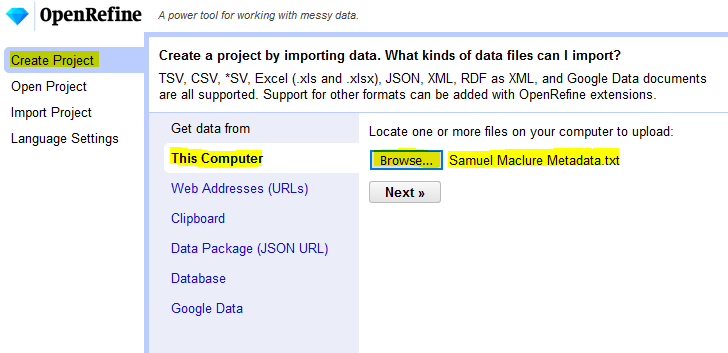
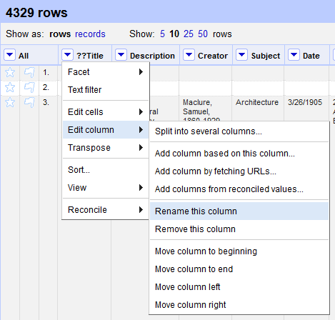
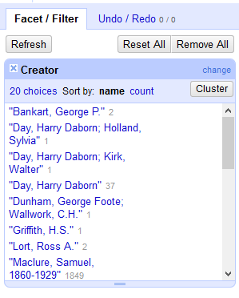
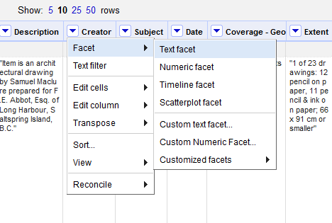
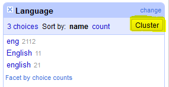
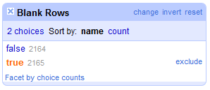
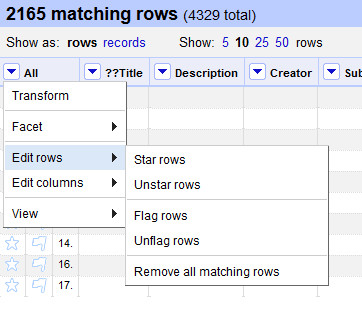
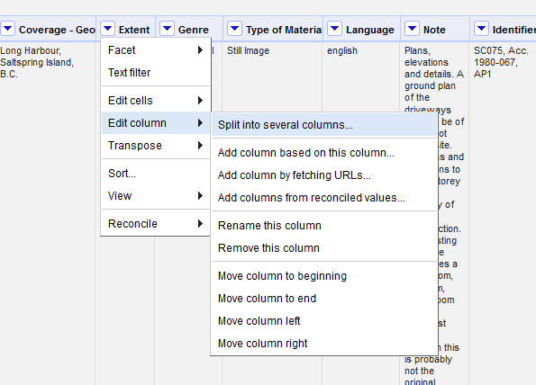
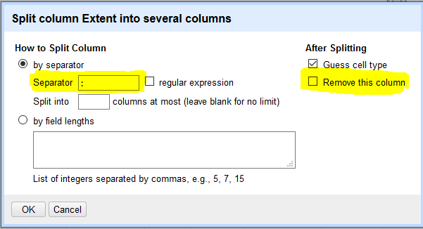
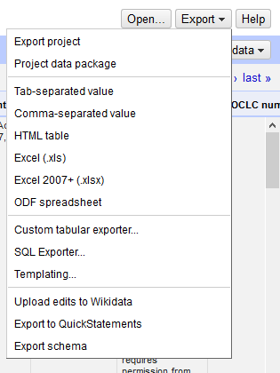

# Cleaning Data With OpenRefine

## A) Download and Installation

1.  Download OpenRefine 3.3 from [this website.](http://openrefine.org/download.html){:target="_blank"}
2.  Follow the [installation instructions](https://github.com/OpenRefine/OpenRefine/wiki/Installation-Instructions){:target="_blank"} for your Operating System.
3.  Download the [Samuel Maclure dataset.](https://drive.google.com/file/d/1ojvI40AOyiPTd_C5FiAT1hdOCQOXB5BI/view?usp=sharing){:target="_blank"}

## B) Importing Data Into OpenRefine and Navigating the Interface

1.  Run the OpenRefine app (or double click on the `openrefine.exe` file). 
    <mark><b>Note:</b> Although the OpenRefine application will open in your default browser window, it is being run locally and data is not being uploaded or shared online.</mark>
2.  The first page you will see is the data import page. We will be creating a new project by importing a data file. Make sure that “Create Project” is highlighted in the left-most menu.
3.  OpenRefine allows you to connect to either local or online sources. We will be uploading a local *.txt file.

    

4.  Under the “Get data from” heading, select **This Computer** and click **Choose Files…**
5.  In the window that opens, navigate to the **“Samuel Maclure Metadata.txt”** file, select it and click **Open**.
6.  Back in the OpenRefine window, click **Next**
7.  Before importing your data, OpenRefine provides a preview of how it is being read.
8.  Our file organizes the data contained by tab-separated values (TSV). Under the **Parse data as** menu, select **CSV / TSV / separator-based files**.
9.  Now that your import settings are set up, you can click **Create Project** in the top right corner.

    

## C) Exploring Your Data

1.  Once the data is imported into OpenRefine, you should see that 4329 rows have been identified. However, OpenRefine only allows you to display up to 50 rows at a time in the display window. You can modify how many rows you want displayed in the top toolbar.
2.  Read through all the column headings and examine the data in the rows underneath. Do they make sense? Are there any typos?
3.  The first column heading “??Title” has a typo in it. To change it, click the arrow next to the heading. In the drop-down box that appears, hover over **Edit column** and then select **Rename this column**. In the dialogue box that appears, change the column name to **"Title”** and select **OK**.

    

## D) Undo / Redo

-   You can undo your actions by clicking on your history in the Undo / Redo tab (far-left menu, next to Facet / Filter).

    

## E) Faceting

1.  You can inspect the different data values in each column by displaying them in facets. For example, to see how many Creators are represented in the dataset, click the drop-down arrow next to the **Creator** column, hover over **Facet**, and select **Text facet**.
2.  A box listing all unique values in the Creator column should appear in the left panel, with counts listed. You can filter your data by clicking on one of the values listed.
3.  To undo any filters applied to your data, click the **Reset All** button.

    

    

## F) Clustering and Standardizing

1.  Create a text facet for the **Language** column. There are three choices: “eng”; “English”; and “english”. Let’s make these consistent across cells.
2.  Click the **Cluster** button in the Language facet.
3.  A window should appear for clustering and editing values in the column. This feature helps you find groups of cell values the program identifies as likely representing the same thing.
4.  By default, OpenRefine proposes the most frequent value be used as the new value across the identified cells. However, you have the option of selecting another value, or proposing a new one. Let’s use the default “english”, for now. Select the checkbox under **Merge?** and then click **Merge Selected & Close**.

    

5.  In the Language facet, you should now see only two choices: “eng” and “english”. You can also alter values directly in the facet. Let’s modify “eng” to read “english”. Hover your cursor over the “eng” option and click on the **edit** link that appears. In the text box that pops up, write “english”. Click **OK**.

    

## G) Removing Blank Rows

1.  Looking at your data in the display window, we see that there are a number of empty rows separating our data.
2.  Let’s search the file for rows with cells that are all blank. Click the dropdown arrow next to **All** (far left). Hover your cursor over **Facet**, and select **Facet by blank (null or empty string)**.

    

3.  In the facet that appears, you should see 2165 values for which this condition is “True”, and 2164 values for which this facet is “False”. Since we want to remove rows that do not have an ID, let’s include only cells for which this condition is true. Hover your mouse over the true option, and select **include**.
4.  Now we need to remove these blank rows from the data set. Click the dropdown arrow next to **All** (far left). Hover over **Edit rows** and select **Remove all matching rows**. This removes all rows that match our filter.

    

## H) Splitting

1.  Sometimes you need to split apart information that is contained in the same cell into separate columns. Create a **text facet** for the **Extent** column.
2.  Scanning the choices in the facet, it appears that information in this column follows the format: Number of objects : Medium ; Dimensions. 
3.  Click the drop down arrow next to the **Extent** column heading. Hover over **Edit column** and select **Split into several columns…**
4.  In the menu that appears, specify that column will be split by separator, and input a colon **“:”** into the text box.
5.  Under the **After Splitting** heading, uncheck the **Remove this column** option. Click **OK**.

    

6.  Two new columns will have been created called “Extent 1” and “Extent 2”.

    

7.  Repeat this same process on the “Extent 2” column, this time specifying a semi-colon **“;”** as the separator character, and keep **Remove this column** checked.
8.  Rename your 3 new columns as follows: **“Number of objects”, “Medium” and “Dimensions”**.

    

## I) Trimming Blank Spaces

1.  Notice how the new extent columns have leading white spaces? We can get rid of these easily.
2.  Click the drop-down arrow on the “Medium” column. Hover over **Edit cells -> Common transforms -> Trim leading and trailing whitespace**.
3.  Repeat for the “Dimensions” column.

    

## J) Joining

1.  Rather than rely on menus to perform functions in OpenRefine, you can also clean your data using GREL (Google Refine Expression Language). Using this syntax also allows you to perform more complex functions, as your skills and needs grow. (Here is a nice cheat sheet on GREL: [https://guides.library.illinois.edu/openrefine/grel](https://guides.library.illinois.edu/openrefine/grel){:target="_blank"})
2.  Joining columns requires the use of GREL regular expressions. Let’s join the **Type of Material** column with our new **Number of Objects** column. Go to the **Type of Material** column, click the drop down arrow, hover your cursor over **Edit cells** and then choose **Transform**.
3.  A pop-up window will appear with several sections, including a GREL expression input box and a preview panel.
4.  The expression for combining column information is: `value + cells['Column Name'].value`
    -   "Value" indicates the values in the current column.
    -   "Column" should match the name of the column whose values you would like to combine with the current column.
5.  To combine column information AND additional strings, use a “+.” For example: `value + " (" + cells['Number of objects'].value + ")"`
    -   Watch the preview area below to see the transformation. Click **OK** when satisfied with the result.

    
    
    

## K) Saving and Exporting

1.  OpenRefine saves your progress automatically.
2.  If you want to export your work in OpenRefine so that you can resume it on another computer, click the **Export** button in the top-right corner, then select **Export project**. You will have the option to save the file to a local directory, or to Google Drive.
3.  If you are finished cleaning your data, you can choose to export a file with the current settings enabled. the Export button in the top-right corner, then select your preferred format (e.g. Excel (.xls), Tab-separated value, etc.).

  [NEXT STEP: Test Yourself](act-2.html){: .btn .btn-blue }
